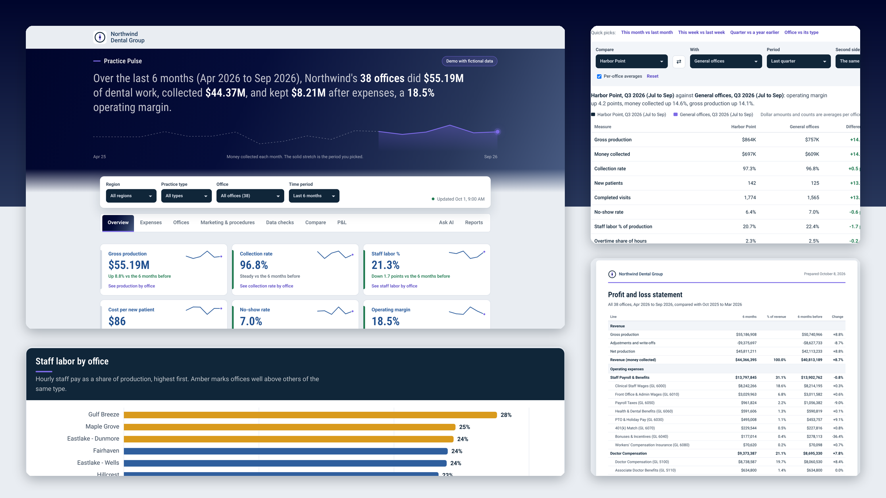

# Practice Pulse

A data warehouse for a multi-office dental group, with a dashboard on top.

Dental groups usually run each office on whichever practice-management system (PMS) it came with, and keep the books, payroll, supplies and marketing in separate tools. Nothing joins them, so a simple question like "which offices are profitable after labor and supplies?" means exporting spreadsheets from five systems. Practice Pulse loads every system into one warehouse, translates each system's codes into a shared set, and serves the results through one dashboard.

> **All data in this repo is fictional.** "Northwind Dental Group", its 38 offices, providers and numbers are generated by `sample_data/generate.py`. No patient data is used anywhere.



## How it fits together

```
 Source systems                    Warehouse (BigQuery / DuckDB)                 Interface
 ───────────────                   ─────────────────────────────                 ─────────
 PMS: Open Dental, Dentrix,  ─┐
   Ascend, Sensei, Dolphin,   │    raw       one table per source file, as delivered
   TDO, DOX                   ├──▶ ref       seeds: location crosswalk, CDT codes,      ──▶  Dashboard
 Accounting: Sage Intacct     │              chart of accounts, payroll codes, UTM map       (HTML + JS)
 Payroll/time: UKG            │    staging   typed, translated, one shape per subject         + AI assistant
 Inventory                    │    marts     monthly/weekly office metrics, opex, P&L,
 Marketing: Google Ads, Meta, ┘              marketing channels, procedure mix,
   GA4                                       GL reconciliation
```

- **Ingestion** (`ingestion/`, `ingest.py`, `load_raw.py`): API connectors (Open Dental, Dentrix Ascend, Sage Intacct, ad platforms), report-export pickup over SFTP/folders, and read-only SQL extracts. Files land untouched in `raw`. In production, managed tools (e.g. Fivetran) can feed accounting and payroll directly.
- **Translation** (`seeds/`): every system names an office, a procedure or a GL account differently. The crosswalks map them all to one key, and `dq_unmapped` flags anything new that has no mapping yet.
- **Models** (`dbt/` for BigQuery, `models/` for local DuckDB): staging views clean and translate each source; marts answer business questions. `mart_reconciliation` checks the general ledger against the operational systems (production, payroll, supplies, ad spend) so you can trust the numbers.
- **Interface** (`dashboard/template.html`): a single-page dashboard with overview, expenses, office scorecard, marketing and procedures, data checks, period comparisons, P&L statements, printable/CSV reports and an AI assistant that answers questions from the warehouse.

## Run it locally

Requires Python 3.10+.

```bash
pip install duckdb numpy pandas sqlglot
python build.py            # generates sample exports, builds the DuckDB warehouse, writes dashboard/index.html
open dashboard/index.html
```

`build.py` generates 18 months of fictional data in each system's native export format, loads it into `warehouse/practice_pulse.duckdb`, runs the staging and mart models, prints the reconciliation check and bakes the results into the dashboard.

## Run it on BigQuery

```bash
cp .env.example .env       # set GCP_PROJECT and any connector credentials
pip install -r requirements.txt
gcloud auth application-default login
python sample_data/generate.py
python load_raw.py         # sample_data/exports -> raw dataset
cd dbt && dbt seed && dbt run && dbt test
```

`live_dashboard/` builds a version of the dashboard that queries the BigQuery marts live instead of using baked-in data (see its README).

## Demo

`demo/demo.html` is a self-contained copy of the dashboard with fictional data embedded. Open it in a browser; no setup needed.

## Repo layout

| Path | What's there |
|------|--------------|
| `sample_data/generate.py` | Fictional source-system exports for 38 offices |
| `seeds/` | Crosswalks and code tables (locations, CDT codes, chart of accounts, payroll codes, inventory, UTM channels) |
| `ingestion/`, `ingest.py`, `load_raw.py` | Connectors and raw loading |
| `warehouse/schema.sql` | Local warehouse layout |
| `models/` | Staging and mart SQL for local DuckDB |
| `dbt/` | The same models as a dbt project for BigQuery, with tests |
| `dashboard/template.html` | The dashboard |
| `live_dashboard/` | Live-query build of the dashboard and its SQL |
| `demo/demo.html` | Standalone demo |

## Notes

- Vendor field names for systems without public API docs are modeled, not confirmed.
- The data includes a few planted patterns (an overstaffed office, weak collections at another, costly paid-social bookings) so the dashboard's alerts have something to find.
